 # .Net Core Identity Membership App

This is a sample application that demonstrates how to use the <b> .Net Core Identity</b> Membership system. It is a simple application that allows users to register, login, and manage their profile. It also allows administrators to manage users and roles.

## Using Tech, Design or Library

## Login and Register Pages

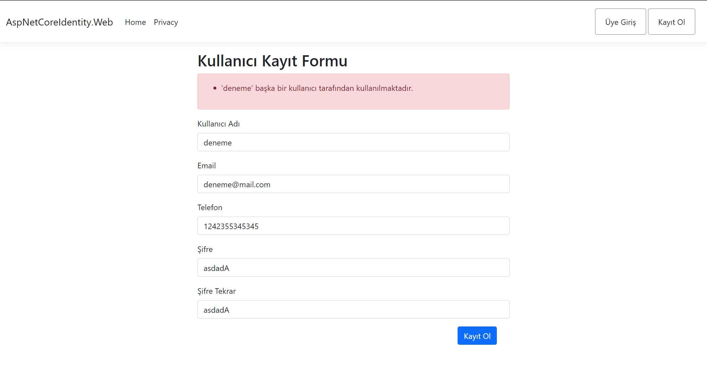
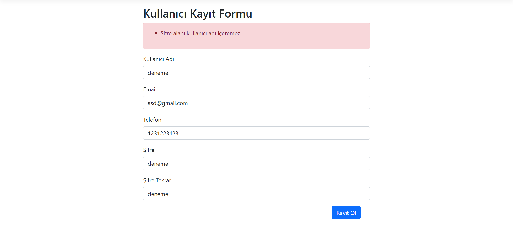
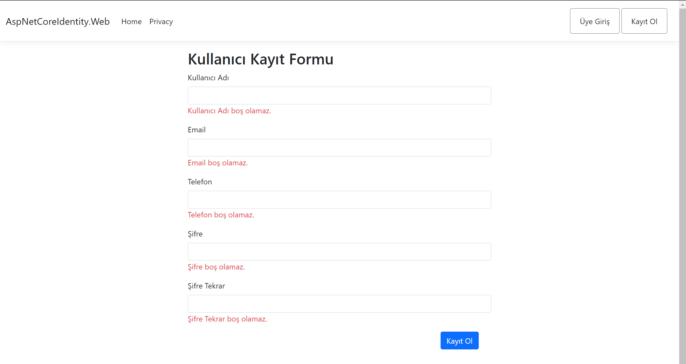
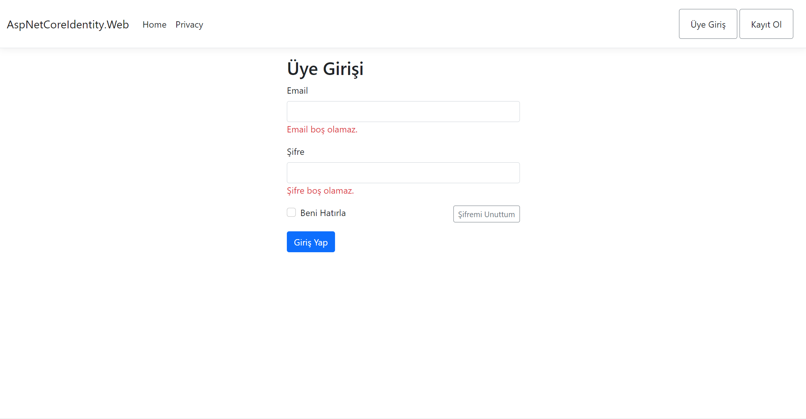
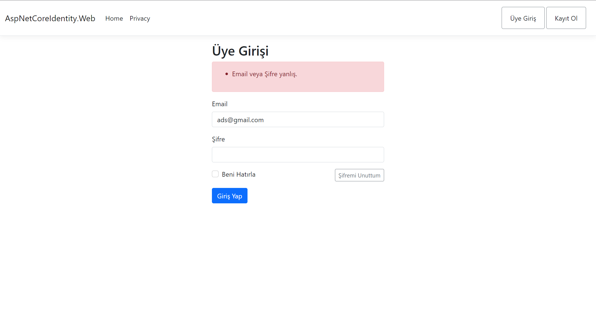

## User Pages
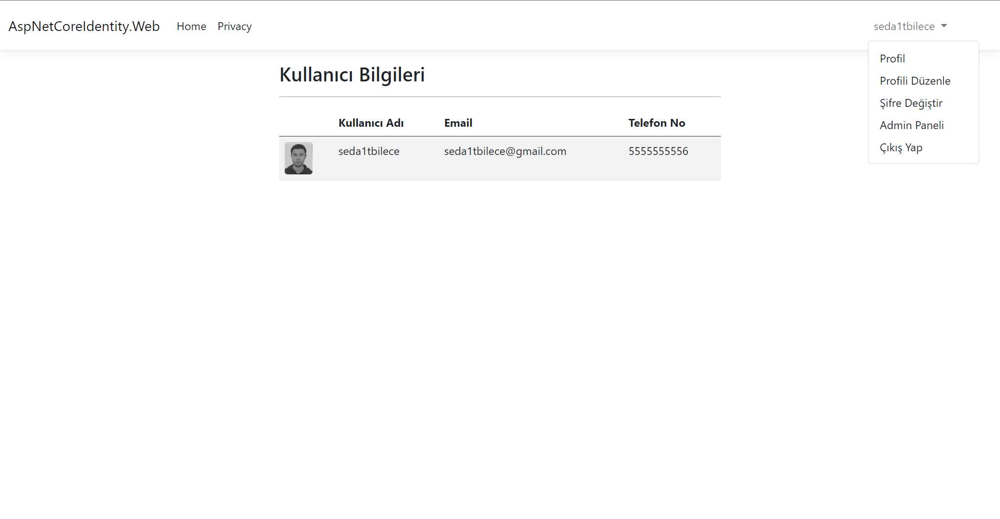
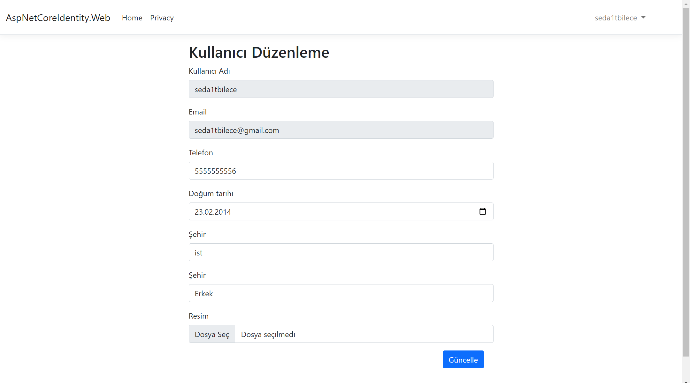
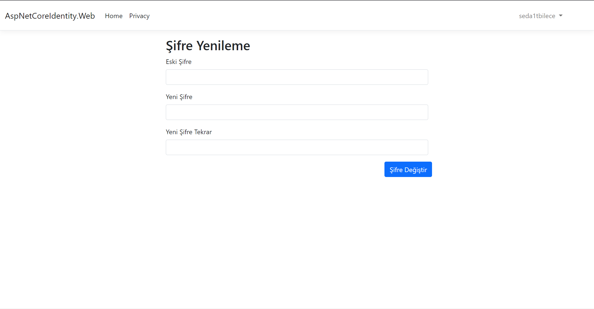

## Admin Pages
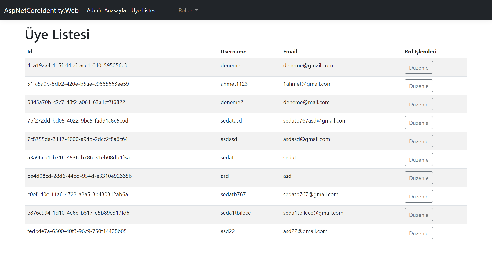
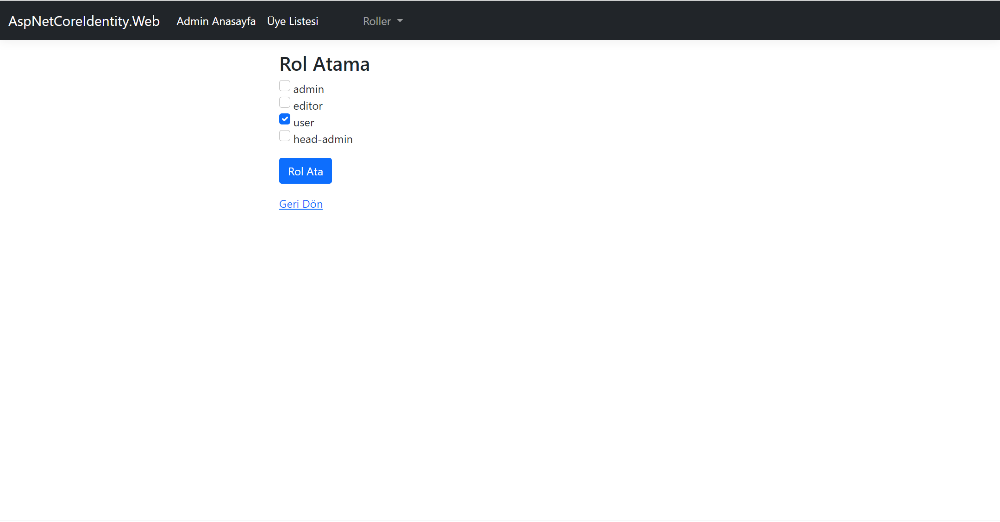
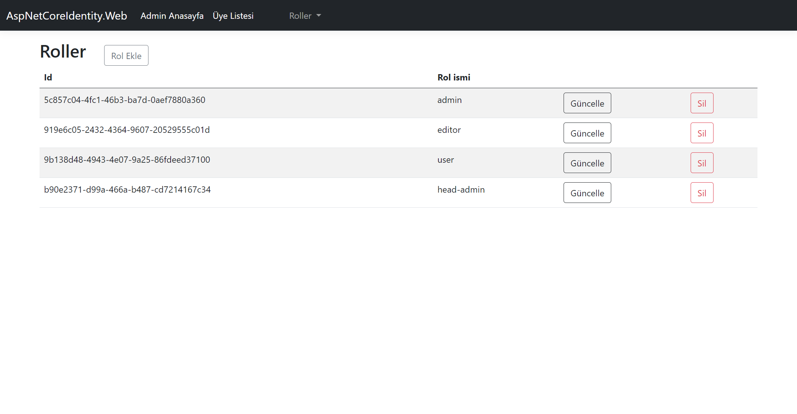
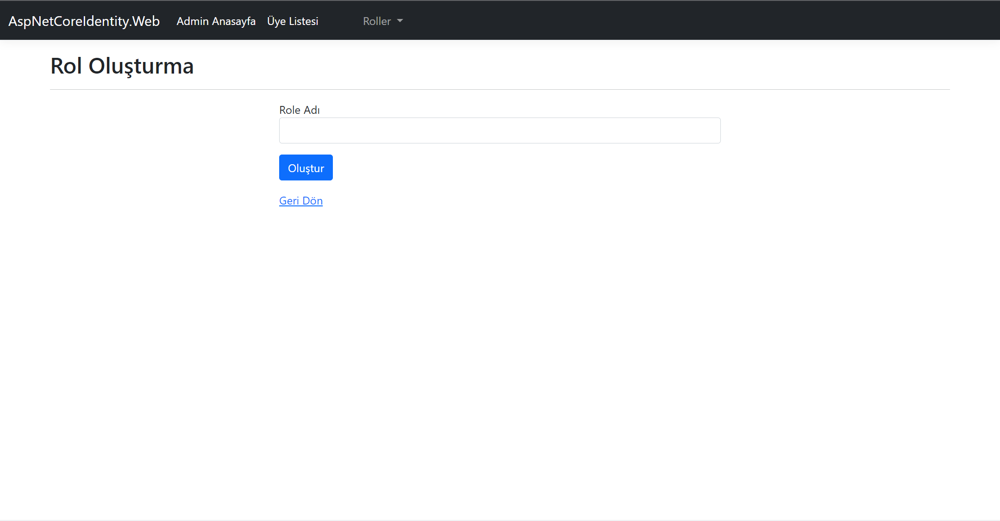
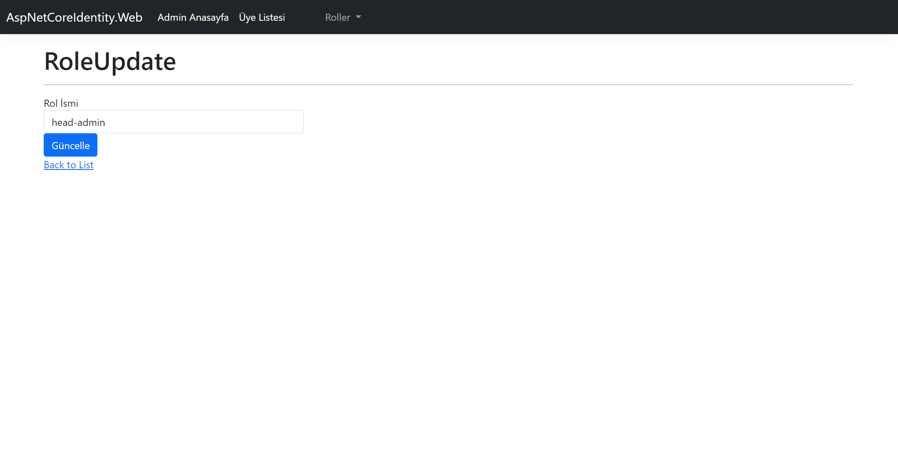
